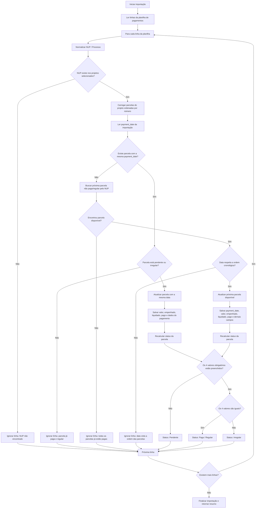

# Fluxograma — Importação de Pagamentos e Atualização Automática de Parcelas

## Objetivo

Este documento descreve a regra de negócio para importação de uma planilha Excel de pagamentos, responsável por atualizar automaticamente as parcelas no banco de dados.

A importação deve identificar a parcela correta com base no **NUP / processo**, respeitando a ordem cronológica das parcelas e priorizando parcelas pendentes ou irregulares.

---

## Conceitos principais

### NUP / Processo

O **NUP** é o número do processo utilizado para relacionar uma linha da planilha de pagamentos com um projeto/parcela existente no sistema.

Cada linha importada deve ser associada a um projeto usando esse número de processo.

---

## Regra de status da parcela

Uma parcela pode estar em um dos seguintes estados:

### 1. Parcela paga / regular

A parcela é considerada **paga e regular** quando os quatro valores abaixo existem no banco de dados e são iguais:

```txt
valor = empenhado = liquidado = pago
```

Campos considerados:

- `valor`
- `empenhado`
- `liquidado`
- `pago`

---

### 2. Parcela pendente

A parcela é considerada **pendente** quando um ou mais dos quatro valores obrigatórios ainda não foram preenchidos:

```txt
valor
empenhado
liquidado
pago
```

Exemplo:

```txt
valor preenchido
empenhado preenchido
liquidado vazio
pago vazio
```

Nesse caso, a parcela ainda não está completamente paga.

---

### 3. Parcela irregular

A parcela é considerada **irregular** quando os quatro valores existem, mas não são iguais.

Exemplo:

```txt
valor:      1000.00
empenhado: 1000.00
liquidado: 900.00
pago:      900.00
```

Como os valores não são todos iguais, a parcela deve ser tratada como irregular.

---

## Regra de ordem cronológica

Por regra de negócio, uma parcela anterior sempre deve ter uma data menor do que a parcela seguinte.

Exemplo correto:

```txt
Parcela 1 → 10/01/2026
Parcela 2 → 15/02/2026
Parcela 3 → 20/03/2026
```

Exemplo incorreto:

```txt
Parcela 1 → 10/03/2026
Parcela 2 → 15/02/2026
```

Nesse caso, a data da parcela 2 é anterior à data da parcela 1, violando a regra cronológica.

---

## Regra principal da importação

Para cada linha da planilha importada, o sistema deve seguir esta prioridade:

```txt
1. Procurar parcela com a mesma payment_date da importação
2. Se existir e estiver pendente ou irregular, atualizar essa parcela
3. Se não existir parcela com a mesma payment_date, buscar a próxima parcela não paga/regular pelo NUP
4. Validar se a data respeita a ordem cronológica das parcelas
5. Atualizar a parcela ou ignorar a linha com motivo
```

---

## Fluxo detalhado da importação

### 1. Ler a planilha

O sistema lê todas as linhas da planilha de pagamentos.

Antes do processamento, é recomendado ordenar os registros por:

```txt
NUP ASC
payment_date ASC
```

Isso ajuda a manter a sequência correta das parcelas.

---

### 2. Normalizar o NUP

Para cada linha da planilha, o sistema deve normalizar o número do processo/NUP.

Essa normalização evita problemas causados por:

- pontuação diferente;
- espaços extras;
- máscaras diferentes;
- caracteres especiais.

---

### 3. Localizar o projeto pelo NUP

O sistema verifica se existe um projeto selecionado relacionado ao NUP informado na planilha.

Se não existir, a linha deve ser ignorada.

Motivo sugerido:

```txt
NUP não encontrado entre os projetos selecionados.
```

---

### 4. Carregar as parcelas do projeto

Após localizar o projeto, o sistema carrega as parcelas relacionadas, ordenadas por número da parcela:

```txt
installment_number ASC
```

---

### 5. Verificar se já existe parcela com a mesma data de pagamento

O sistema verifica se alguma parcela daquele projeto/NUP já possui a mesma `payment_date` da linha importada.

#### Caso exista parcela com a mesma data

O sistema deve verificar o status dessa parcela.

Se ela estiver:

- pendente; ou
- irregular;

então a parcela deve ser atualizada com os dados da importação.

Se ela já estiver paga e regular, o sistema não deve sobrescrever os dados.

Motivo sugerido:

```txt
Já existe uma parcela paga e regular com essa data de pagamento.
```

---

### 6. Caso não exista parcela com a mesma data

Se nenhuma parcela tiver a mesma `payment_date`, o sistema deve buscar a próxima parcela ainda não paga/regular.

A busca deve ser feita pelo menor número de parcela disponível:

```txt
Primeira parcela pendente ou irregular ordenada por installment_number
```

Exemplo:

```txt
Parcela 1 → paga/regular
Parcela 2 → paga/regular
Parcela 3 → pendente
Parcela 4 → pendente
```

Nesse caso, a importação deve atualizar a parcela 3.

---

### 7. Validar a ordem cronológica

Antes de atualizar a parcela escolhida, o sistema deve validar se a `payment_date` importada respeita a ordem das parcelas.

A data da parcela atual deve ser:

- maior que a data da parcela anterior, se existir;
- menor que a data da próxima parcela, se existir.

Exemplo:

```txt
Parcela 1 → 10/01/2026
Parcela 2 → importando 15/02/2026
Parcela 3 → 20/03/2026
```

Resultado: válido.

Exemplo inválido:

```txt
Parcela 1 → 10/03/2026
Parcela 2 → importando 15/02/2026
```

Resultado: inválido, pois a parcela 2 ficaria com data anterior à parcela 1.

---

## Fluxograma em Mermaid



---

## Pseudocódigo da regra de seleção

```php
// Primeiro, tenta encontrar uma parcela com a mesma data de pagamento
$candidate = $installments
    ->filter(fn ($installment) =>
        $installment->payment_date === $importedPaymentDate
        && in_array($installment->status, ['pending', 'irregular'])
    )
    ->sortBy('installment_number')
    ->first();

// Se não encontrou pela data, busca a próxima parcela não paga/regular
if (! $candidate) {
    $candidate = $installments
        ->filter(fn ($installment) => $installment->status !== 'paid_regular')
        ->sortBy('installment_number')
        ->first();
}

// Se não encontrou nenhuma parcela disponível, ignora a linha
if (! $candidate) {
    return 'Todas as parcelas já estão pagas.';
}

// Antes de atualizar, valida a ordem cronológica
if (! respectsInstallmentDateOrder($candidate, $importedPaymentDate, $installments)) {
    return 'Data de pagamento viola a ordem cronológica das parcelas.';
}

// Atualiza a parcela encontrada
$candidate->update([
    'payment_date' => $importedPaymentDate,
    'amount' => $importedValor,
    'committed_amount' => $importedEmpenhado,
    'settled_amount' => $importedLiquidado,
    'payment_amount' => $importedPago,
]);
```

---

## Função conceitual para verificar status

```php
function getInstallmentStatus($installment): string
{
    $values = [
        $installment->amount,
        $installment->committed_amount,
        $installment->settled_amount,
        $installment->payment_amount,
    ];

    $hasMissingValue = collect($values)->contains(fn ($value) => $value === null);

    if ($hasMissingValue) {
        return 'pending';
    }

    $allValuesAreEqual = count(array_unique($values)) === 1;

    if ($allValuesAreEqual) {
        return 'paid_regular';
    }

    return 'irregular';
}
```

---

## Função conceitual para validar a ordem das datas

```php
function respectsInstallmentDateOrder($candidate, $importedPaymentDate, $installments): bool
{
    $previousInstallment = $installments
        ->where('installment_number', '<', $candidate->installment_number)
        ->sortByDesc('installment_number')
        ->first();

    $nextInstallment = $installments
        ->where('installment_number', '>', $candidate->installment_number)
        ->sortBy('installment_number')
        ->first();

    if ($previousInstallment && $previousInstallment->payment_date) {
        if ($importedPaymentDate <= $previousInstallment->payment_date) {
            return false;
        }
    }

    if ($nextInstallment && $nextInstallment->payment_date) {
        if ($importedPaymentDate >= $nextInstallment->payment_date) {
            return false;
        }
    }

    return true;
}
```

---

## Prioridade final da importação

A ordem de decisão da importação deve ser:

```txt
1. Mesmo NUP
2. Mesma payment_date, se existir
3. Parcela com mesma payment_date deve ser atualizada somente se estiver pendente ou irregular
4. Se não existir payment_date igual, buscar a próxima parcela não paga/regular
5. Validar ordem cronológica das datas
6. Atualizar parcela
7. Recalcular status
8. Retornar resumo da importação
```

---

## Resumo esperado ao final da importação

Ao final do processo, o sistema deve retornar um resumo contendo, por exemplo:

```txt
Linhas processadas: 100
Parcelas atualizadas: 82
Linhas ignoradas: 18
Irregulares encontradas: 5
Pendentes atualizadas: 12
NUPs não encontrados: 3
Datas inválidas por ordem cronológica: 2
```

---

## Observações importantes

- A importação não deve sobrescrever uma parcela que já está paga e regular.
- A importação deve permitir corrigir parcelas pendentes ou irregulares.
- A seleção automática da próxima parcela deve sempre ser baseada no NUP.
- A ordem cronológica das parcelas deve ser respeitada.
- O campo `payment_date` tem prioridade quando já existe uma parcela pendente ou irregular com a mesma data.
- Caso não exista uma data igual no banco, o sistema deve atualizar a próxima parcela ainda não paga/regular.
